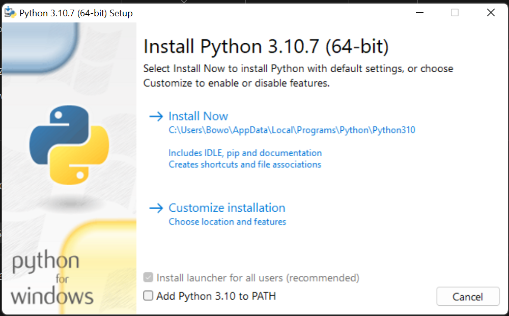
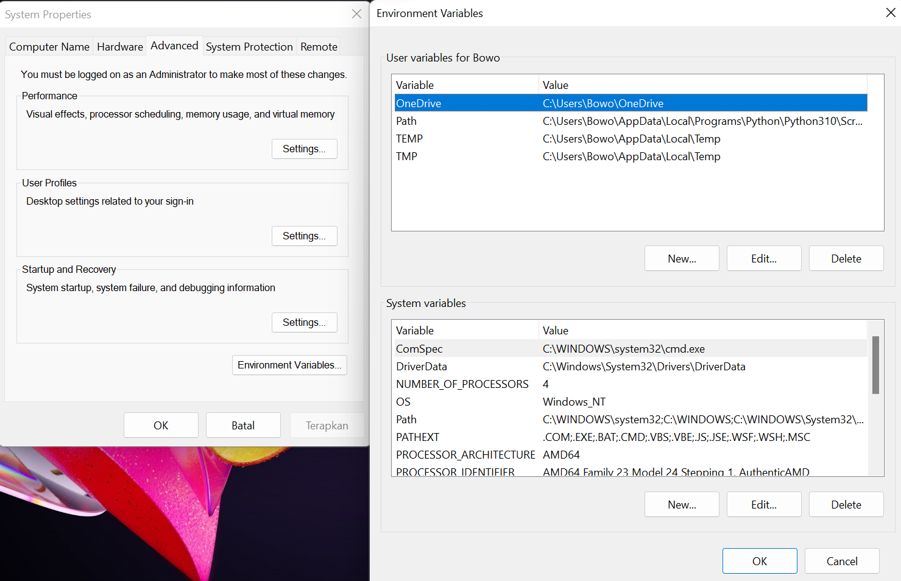
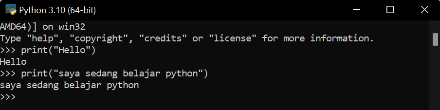

#### lab2py
#### Nama : Herlan Wibowo
#### Kelas: TI 22 A3
#### NIM  : 312210324
#### Cara Instalasi Python
    • Bagi pengguna Linux, Python tidak perlu diinstal.
    Karena Sebagian besar distro Linux sudah
    menyediakannya secara default.
    • Bagi pengguna Windows, Download di situs resmi
    python (python.org). Ikuti langkah instalasinya.
    * Centang pada bagian bawah agar Python dapat di panggil oleh CMD

#### Menambahkan Pyhton PATH secara manual agar dapat dipanggil CMD

#### Contoh Perintah Dasar Python
    #Mengambil data input
    nama = input("Nama saya :")
    umur = input("Umur saya :")
    #Menampilkan output
    print("Hello",nama,"Umur saya",umur,"tahun")
#### Latihan1
    • Menjalankan Python Console
    • Menampilkan tulisan “Hello” dilayar
    • Menampilkan tulisan “Saya sedang belajar python” dilayar

